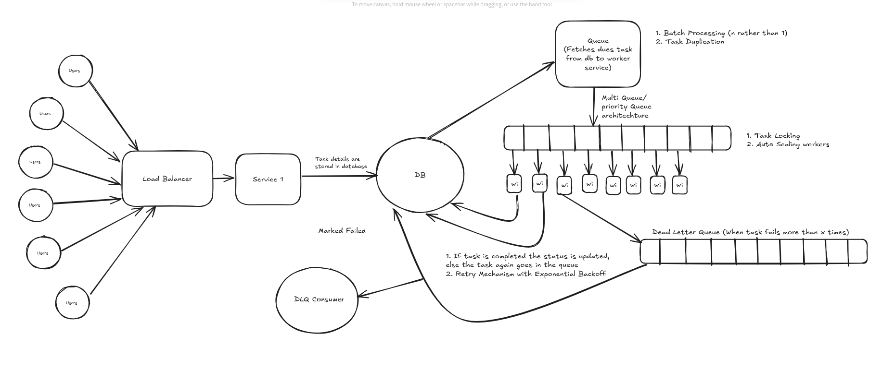

# 🚀 Distributed Task Manager



A scalable and distributed task manager built with **Node.js, Express, MongoDB, Redis, and BullMQ**. This project handles task execution with a worker-based architecture and event-driven messaging using queues.

---

## 🛠 Tech Stack

| Component           | Technology        | Description |
|---------------------|------------------|-------------|
| **Backend**        | Node.js + Express | REST API for task management |
| **Database**       | MongoDB           | Stores tasks and execution details |
| **Queue System**   | Redis + BullMQ    | Manages task distribution across workers |
| **Containerization** | Docker           | Manages services as containers |
| **Service Communication** | REST API | Communicates between microservices |

## 🔄 Flow of Code Execution

1. **Task Submission** → API Service receives a task submission request (POST `/tasks`).
2. **Queue Processing** → Scheduler Service adds the task to BullMQ queue (Redis).
3. **Worker Execution** → Workers consume tasks from BullMQ queue and process them.
4. **Task Completion & Storage** → Worker updates MongoDB with task results.
5. **Centralized DB Service** → Centralized MongoDB service for task storage and retrieval.
6. **Retries & Failure Handling** → BullMQ handles retries with exponential backoff. Failed tasks after max retries are moved to Dead Letter Queue (DLQ).

---

## 🚀 Getting Started

### 1️⃣ Clone the Repository
```sh
git clone https://github.com/vr-varad/distributed-task-manager.git
cd distributed-task-manager
```

### 2️⃣ Install Dependencies
```sh
pnpm install
```

### 3️⃣ Start Redis and MongoDB (Docker)
```sh
docker compose up -d
```

This will start:
- Redis on `localhost:6379`
- MongoDB on `localhost:27017`

### 4️⃣ Start Services
#### Start Databus Service (Database):
```sh
pnpm run start:databus
```
#### Start API Service:
```sh
pnpm run start:api
```
#### Start Scheduler Service:
```sh
pnpm run start:scheduler
```
#### Start Worker Service:
```sh
pnpm run start:worker
```

Or start all services together:
```sh
pnpm run start:all
```

---

## 📊 Architecture Overview

```
Client
   ↓
API Service (Node.js + Express)
   ↓
Scheduler Service
   ↓
BullMQ Queue (Redis)
   ↓
Worker Service(s)
   ↓
MongoDB
```

### How It Works:

1. **API Service** receives task creation requests
2. **Scheduler Service** polls for pending/retrying tasks and adds them to BullMQ queue
3. **BullMQ (Redis)** manages the queue with built-in retry logic and exponential backoff
4. **Worker Service** processes jobs from the queue
5. **MongoDB** stores all task data and status
6. **DLQ (Dead Letter Queue)** receives tasks that failed after all retry attempts

---

## 🔄 Task Processing Flow

```
Task Created (API)
      ↓
Stored in MongoDB (PENDING)
      ↓
Scheduler finds PENDING task
      ↓
Task added to BullMQ Queue
      ↓
Worker picks up task
      ↓
   Success? ──Yes──> Task COMPLETED
      │
      No
      ↓
Max retries reached?
      │
      ├──No──> Retry with exponential backoff
      │
      └──Yes──> Move to DLQ + Mark as FAILED
```

---

## ⚙️ Retry & Failure Handling

### Exponential Backoff
BullMQ automatically handles retries with exponential backoff:

```javascript
{
  attempts: 3,  // Max retry attempts
  backoff: {
    type: 'exponential',
    delay: 1000  // Initial delay: 1s, then 2s, 4s, 8s...
  }
}
```

### Dead Letter Queue (DLQ)
When a task fails after all retry attempts:
1. Task is moved to `dlq-queue` in Redis
2. Task status updated to `FAILED` in MongoDB
3. Error details stored with the failed job

---

## 🛠️ Environment Variables

Create a `.env` file in each service directory:

```bash
# Redis Configuration
REDIS_HOST=localhost
REDIS_PORT=6379

# MongoDB Configuration
MONGO_URI=mongodb://localhost:27017/taskmanager

# Worker Configuration
WORKER_CONCURRENCY=1  # Number of concurrent jobs per worker
```

---

## 🧪 Testing

### Create a Task
```bash
curl -X POST http://localhost:3000/api/tasks \
  -H "Content-Type: application/json" \
  -d '{
    "name": "Test Task",
    "maxRetries": 3,
    "backoffDelay": 1000
  }'
```

### Check Task Status
```bash
curl http://localhost:3000/api/tasks/:taskId
```

### View Failed Tasks (DLQ)
Failed tasks are stored in the `dlq-queue` in Redis. You can view them using:

```bash
redis-cli
> LRANGE bull:dlq-queue:failed 0 -1
```

---

## 📈 Scaling Workers

You can run multiple worker instances for horizontal scaling:

```bash
# Terminal 1
pnpm run start:worker

# Terminal 2  
pnpm run start:worker

# Terminal 3
pnpm run start:worker
```

BullMQ automatically distributes jobs across all available workers.

---

## 🔍 Monitoring

### Redis CLI Commands
```bash
# Connect to Redis
redis-cli

# Check queue length
LLEN bull:task-queue:wait

# View active jobs
LRANGE bull:task-queue:active 0 -1

# View failed jobs
LRANGE bull:task-queue:failed 0 -1

# View DLQ
LRANGE bull:dlq-queue:wait 0 -1
```

---

## 🛑 Stopping Services

### Stop Docker containers
```bash
docker compose down
```

### Stop with data cleanup
```bash
docker compose down -v
```

---

## 📦 Project Structure

```
distributed-task-manager/
├── apps/
│   ├── api-service/          # REST API endpoints
│   ├── databus-service/      # MongoDB operations
│   ├── schedular-service/    # Task scheduling & queue management
│   ├── worker-service/       # Task processing workers
│   └── dlq-service/          # Dead letter queue monitoring
├── docker-compose.yml         # Redis + MongoDB setup
└── README.md
```

---

## 🎯 Key Features

- ✅ **Distributed Task Processing** with BullMQ
- ✅ **Automatic Retries** with exponential backoff
- ✅ **Dead Letter Queue** for failed tasks
- ✅ **Horizontal Scaling** of workers
- ✅ **Persistent Queue** (Redis with AOF)
- ✅ **Job Concurrency Control**
- ✅ **Event-Driven Architecture**

---

## 🔧 Troubleshooting

### Redis Connection Error
```
Error: connect ECONNREFUSED 127.0.0.1:6379
```
**Solution:** Make sure Redis is running via Docker:
```bash
docker compose up -d redis
```

### MongoDB Connection Error
```
Error: connect ECONNREFUSED 127.0.0.1:27017
```
**Solution:** Make sure MongoDB is running:
```bash
docker compose up -d mongodb
```

---

## 📝 License

MIT